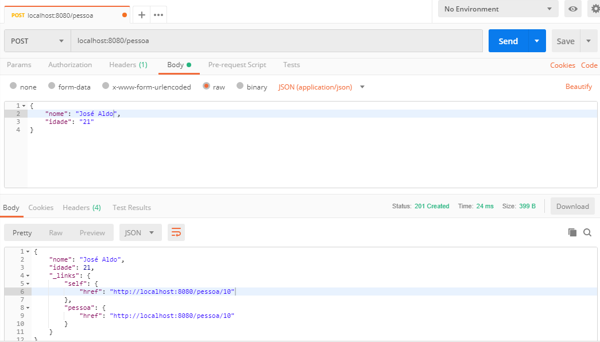

# SpringBootMongoDbRestApi

Este exemplo básico mostra como criar uma API REST com SpringBoot e MongoDB.

### Pré-requisitos

Para executar a instalação, desenvolvimento e testes deverá ter instalado as seguintes tecnologias abaixo:

* [Java](https://www.oracle.com/technetwork/java/javase/downloads/jre8-downloads-2133155.html) - Plataforma Java
* [Maven](https://maven.apache.org/) - Ferramenta de automação
* [Spring Boot](http://spring.io/projects/spring-boot/) - Ferramenta facilita a criação de projetos
* [Spring Tool Suite](https://spring.io/tools) - IDE de desenvolvimento
* [MongoDB](https://www.mongodb.com/) - Banco de dados orientado a documentos
* [Postman](https://www.getpostman.com/) - Postman Makes API Development Simple

### Testes

## Author

* **Lucas A de Miranda Correia** - *Initial work* - [LAMC](https://github.com/lucasagnaldo)
